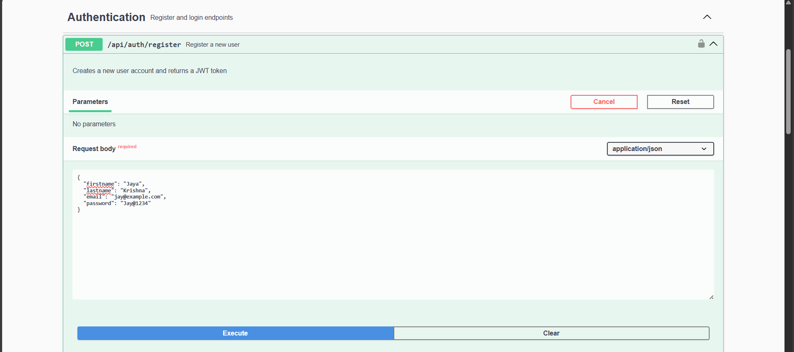
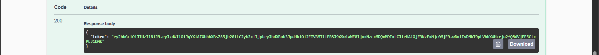
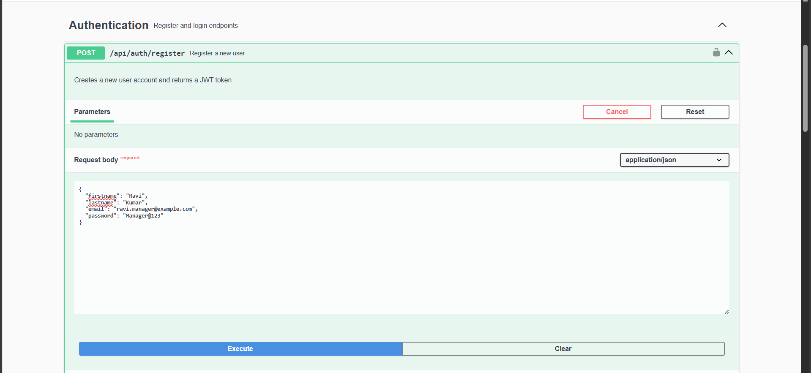
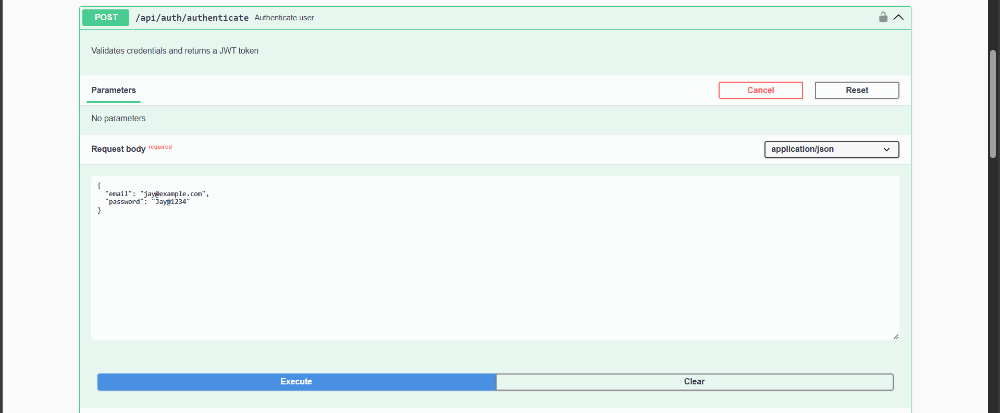
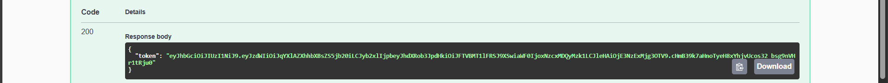
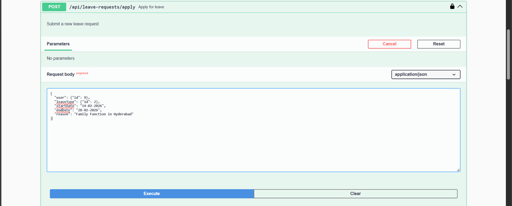
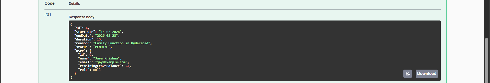
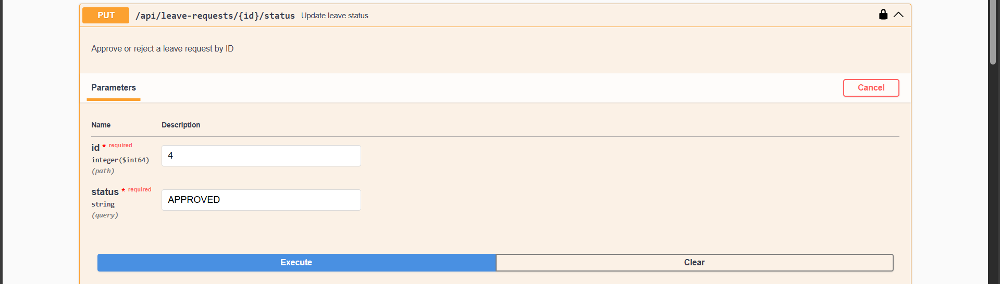
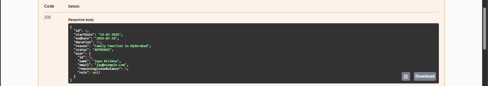
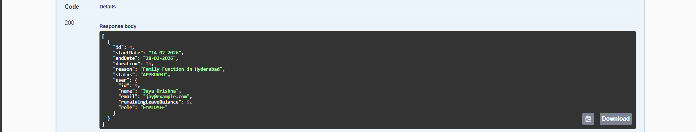

# 🌴 Employee Leave Management System

A production-grade **REST API** built with **Spring Boot** for managing employee leave requests, approvals, and balance tracking — featuring **JWT authentication**, **role-based access control**, and **Swagger API documentation**.

---

## ✨ Highlights

| Feature                      | Description                                                            |
|------------------------------|------------------------------------------------------------------------|
| 🔐 **JWT Authentication**    | Stateless token-based auth with Spring Security                        |
| 👥 **Role-Based Access**     | Employee & Manager roles with endpoint-level restrictions              |
| 📊 **Smart Leave Balance**   | Auto-calculates duration, deducts on approval, restores on cancellation|
| ⚛️ **Atomic Transactions**   | `@Transactional` ensures balance + status update consistency           |
| 🛡️ **DTO Security**         | Separates internal entities from API responses — no password leaks     |
| 🗑️ **Soft Delete**          | Leave requests are soft-deleted (`deleted = true`), never lost         |
| ✅ **Input Validation**      | Bean Validation with clear error messages                              |
| 📖 **Swagger UI**            | Interactive API docs at `/swagger-ui/index.html`                       |

---

## 🏗️ Architecture

```
┌─────────────┐      ┌──────────────┐     ┌─────────────┐     ┌──────────┐
│   Client     │────▶│  Controller  │────▶│   Service   │────▶│   Repo   │
│  (Swagger)   │◀────│   (REST)     │◀────│  (Business  │◀────│  (JPA)   │
│              │     │              │     │   Logic)    │     │          │
└─────────────┘      └──────────────┘     └─────────────┘     └──────────┘
                           │                                       │
                    ┌──────┴───────┐                          ┌────┴────┐
                    │ JWT Filter   │                          │  MySQL  │
                    │ Security     │                          │   DB    │
                    └──────────────┘                          └─────────┘
```

### Project Structure

```
src/main/java/elms/
├── auth/                  # Authentication (Register, Login, JWT)
│   ├── AuthenticationController.java
│   ├── AuthenticationService.java
│   ├── AuthenticationRequest.java
│   ├── AuthenticationResponse.java
│   └── RegisterRequest.java
├── security/              # Spring Security + JWT
│   ├── SecurityConfig.java
│   ├── JwtAuthenticationFilter.java
│   ├── JwtService.java
│   └── ApplicationConfig.java
├── controller/            # REST API Endpoints
│   └── LeaveRequestController.java
├── service/               # Business Logic Layer
│   ├── LeaveRequestService.java
│   ├── LeaveRequestServiceImpl.java
│   ├── UserService.java
│   └── UserServiceImpl.java
├── entities/              # JPA Entities
│   ├── User.java
│   ├── LeaveRequest.java
│   ├── LeaveType.java
│   ├── LeaveStatus.java
│   └── Role.java
├── dto/                   # Data Transfer Objects
│   ├── LeaveRequestResponseDTO.java
│   ├── UserResponseDTO.java
│   ├── LoginRequest.java
│   └── ErrorResponse.java
├── repository/            # Data Access Layer
│   ├── LeaveRequestRepository.java
│   ├── LeaveTypeRepository.java
│   └── UserRepository.java
├── exception/             # Custom Exception Handling
│   ├── GlobalExceptionHandler.java
│   ├── ResourceNotFoundException.java
│   ├── LeaveBalanceException.java
│   └── DuplicateEmailException.java
└── config/                # App Configuration
    └── OpenApiConfig.java
```

---

## 🛠️ Tech Stack

| Layer            | Technology                          |
|------------------|-------------------------------------|
| **Language**     | Java 17                             |
| **Framework**    | Spring Boot 3.4.2                   |
| **Security**     | Spring Security + JWT (jjwt 0.11.5) |
| **Database**     | MySQL                               |
| **ORM**          | Spring Data JPA / Hibernate         |
| **Validation**   | Jakarta Bean Validation             |
| **API Docs**     | SpringDoc OpenAPI (Swagger UI)      |
| **Build**        | Maven                               |
| **Utilities**    | Lombok                              |

---

## 🛣️ API Endpoints

### 🔓 Authentication (Public)

| Method   | Endpoint                   | Description                          |
|----------|----------------------------|--------------------------------------|
| `POST`   | `/api/auth/register`       | Register a new user (returns JWT)    |
| `POST`   | `/api/auth/authenticate`   | Login with credentials (returns JWT) |

### 📋 Leave Requests (Authenticated)

| Method     | Endpoint                               | Access       | Description                          |
|------------|----------------------------------------|--------------|--------------------------------------|
| `POST`     | `/api/leave-requests/apply`            | Employee     | Submit a new leave request           |
| `GET`      | `/api/leave-requests/all`              | 🔒 Manager   | View all leave requests              |
| `PUT`      | `/api/leave-requests/{id}/status`      | 🔒 Manager   | Approve or reject a request          |
| `GET`      | `/api/leave-requests/user/{userId}`    | Any          | Get leave history for a user         |
| `PUT`      | `/api/leave-requests/{id}`             | Employee     | Update a pending leave request       |
| `GET`      | `/api/leave-requests/filter?status=`   | 🔒 Manager   | Filter requests by status            |
| `DELETE`   | `/api/leave-requests/{id}`             | Employee     | Cancel a request (restores balance)  |

---

## 📊 Business Logic

### Leave Balance Workflow

```
Employee Applies          Manager Reviews         System Updates
    │                          │                       │
    ▼                          ▼                       ▼
┌─────────┐  validate    ┌───────────┐  approve  ┌──────────────┐
│ Request │ ──────────▶  │  PENDING  │ ────────▶ │   APPROVED   │
│ X days  │  balance ≥ X └───────────┘           │ Balance -= X │
└─────────┘                    │                 └──────────────┘
                               │ reject
                               ▼
                         ┌───────────┐
                         │ REJECTED  │  (No balance change)
                         └───────────┘
```

**Key Rules:**
- ✅ Duration auto-calculated: `endDate - startDate + 1`
- ✅ Start date must be today or future (`@FutureOrPresent`)
- ✅ Balance check happens **before** request is saved
- ✅ Balance deducted **only** on approval (atomic transaction)
- ✅ Balance restored on cancellation of approved leave

---

## 📸 API Screenshots (Swagger UI)

### 1. User Registration
<p align="center">
  
  <br/><em>POST /api/auth/register — Employee registration with name, email & password</em>
</p>

<p align="center">
  
  <br/><em>Response — JWT token returned upon successful registration</em>
</p>

### 2. Manager Registration
<p align="center">
  
  <br/><em>Manager account created, then promoted via database (admin-controlled role assignment)</em>
</p>

### 3. Authentication (Login)
<p align="center">
  
  <br/><em>POST /api/auth/authenticate — Login with email & password</em>
</p>

<p align="center">
  
  <br/><em>Response — Fresh JWT token for authenticated API access</em>
</p>

### 4. Apply for Leave (Employee)
<p align="center">
  
  <br/><em>POST /api/leave-requests/apply — Employee submits leave with dates & reason</em>
</p>

<p align="center">
  
  <br/><em>Response — 201 Created, status set to PENDING, duration auto-calculated</em>
</p>

### 5. Approve Leave (Manager)
<p align="center">
  
  <br/><em>PUT /api/leave-requests/{id}/status — Manager approves with status = APPROVED</em>
</p>

<p align="center">
  
  <br/><em>Response — Status updated, leave balance deducted automatically</em>
</p>

### 6. View All Requests (Manager Dashboard)
<p align="center">
  
  <br/><em>GET /api/leave-requests/all — Manager views all employee requests with role-based access</em>
</p>

### 7. Employee Leave History
<p align="center">
  
  <br/><em>GET /api/leave-requests/user/{userId} — Complete leave history for a specific employee</em>
</p>

---

## 🔐 Security Implementation

| Component                   | Purpose                                                  |
|-----------------------------|----------------------------------------------------------|
| `JwtAuthenticationFilter`   | Intercepts requests, extracts & validates JWT tokens     |
| `JwtService`                | Generates, validates, and extracts claims from JWT tokens|
| `SecurityConfig`            | Configures filter chain, public/protected endpoints      |
| `@PreAuthorize`             | Method-level role checks (`hasAuthority('MANAGER')`)     |
| `UserDetails`               | User entity implements Spring Security's `UserDetails`   |
| **Stateless Sessions**      | No server-side session storage — fully token-based       |

---

## 🚦 Getting Started

### Prerequisites
- Java 17+
- Maven 3.8+
- MySQL 8.0+

### Setup

1. **Clone the repository**
```bash
git clone https://github.com/PolakiJayaKrishna/employee-leave-management-api.git
cd employee-leave-management
```

2. **Configure MySQL** — Update `src/main/resources/application.properties`:
```properties
spring.datasource.url=jdbc:mysql://localhost:3306/elms_db
spring.datasource.username=your_username
spring.datasource.password=your_password
```

3. **Run the application**
```bash
mvn spring-boot:run
```

4. **Access Swagger UI**
```
http://localhost:8080/swagger-ui/index.html
```

---

## 🧠 What This Project Demonstrates

- **Real business logic** — not just CRUD, but balance management, approval workflows, and role enforcement
- **Security best practices** — JWT auth, stateless sessions, DTO pattern to prevent data leaks
- **Transactional integrity** — atomic operations for balance updates using `@Transactional`
- **Clean architecture** — layered design (Controller → Service → Repository) with separation of concerns
- **Production patterns** — soft delete, input validation, custom exception handling, API documentation

---

## 📌 Future Enhancements

- [ ] Email notifications for leave approvals/rejections
- [ ] Leave the analytics dashboard with charts
- [ ] Admin panel for managing leave types and quotas
- [ ] Calendar integration for team availability view
- [ ] Unit & integration tests with JUnit 5

---

<p align="center">
  Built with ☕ Java & Spring Boot 
</p>
